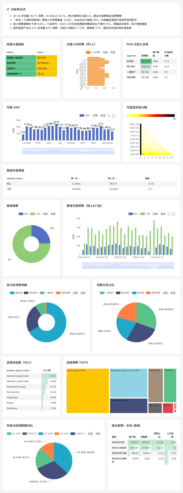

# H&M 电商经营分析项目

## 项目背景

本项目基于 H&M 官方公开的电商交易数据，完成了一次从数据获取、清洗建模到可视化分析、结论输出的完整数据分析实践（分析报告见 [docs/analysis.md](docs/analysis.md)）。项目用于练习数据分析岗位所需的 SQL、Python 和 BI 工具技能，所有代码和分析过程均可复现。

## 数据说明

- 数据来源：H&M 官方公开数据集（Kaggle 竞赛数据，通过 HuggingFace 镜像获取）
- 数据规模：约 3,178 万条交易记录、137 万客户、10.5 万件商品，时间覆盖 2018 年 9 月至 2020 年 9 月
- 口径说明：官方对价格做了归一化处理，因此本项目中的销售额为相对值，分析重点放在占比、增长和用户行为指标上
- 数据质量备注：2020 年 4 月线上渠道数据缺失（疑似记录异常），占比约 5%，不影响整体结论

## 分析内容

1. 数据清洗与建模：使用 Python 处理原始数据，构建事实表和维度表，并派生日销售、月度指标、RFM 分层、留存 cohort 等分析表
2. 指标体系：围绕经营大盘设计 GMV、销量、客户数、复购率、留存率等指标
3. 可视化看板：使用 Apache Superset 搭建 10 余张图表组成的经营分析看板，覆盖销售趋势、渠道结构、品类结构、用户分层、年龄段与会员客群分析
4. 自动化验证：编写脚本自动验证全部图表正常出数，保证项目可复现

## 主要结论

- 渠道结构：线上贡献约 24%、门店约 76%；对比两个完整年度，线上销售额下滑 15.8%，门店基本持平（-0.7%）
- 客群结构：25-34 岁贡献 36.7% 消费、45 岁以上 31.2%，两大客群合计约 68%；「会员 × 订阅时尚新闻」客群人均消费最高（0.80），比会员未订阅高 29%，内容触达是提升客单的有效抓手
- 用户价值：高价值用户占 21%，贡献约 67% 的消费额，头部效应明显
- 复购表现：月度复购率均值约 77%，人均月购买 4~5 件
- 疫情影响：2020 上半年销售额同比下降约 13.2%（3 月降幅最大 -19.4%），此后逐月收窄，处于恢复通道

## 项目结构

```
├── scripts/          # 数据下载、建库、搭建看板、自动验证脚本
├── dashboard/        # Superset 看板导出文件
├── docs/
│   ├── screenshots/  # 看板截图
│   └── analysis.md   # 分析报告
└── data/             # 本地数据（不入库，由脚本生成）
```

## 复现步骤

```bash
# 1. 下载数据（约 900MB）
python scripts/download_data.py

# 2. 构建分析数据库
python scripts/build_database.py

# 3. 在 Superset 中自动搭建看板（需先启动 Superset）
python scripts/build_superset_dashboard.py

# 4. 自动验证全部图表正常出数
python scripts/verify_dashboard.py
```

## 看板截图



## 许可证

MIT